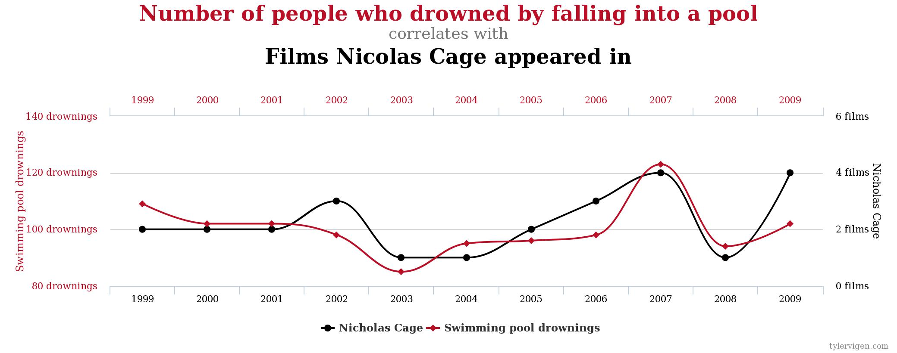

```{r setup, include=FALSE, message = FALSE, warning=FALSE}
knitr::opts_chunk$set(echo = TRUE)
library(tidyverse)
```

## Overview

- Over the semester, we will often ask: What is the effect of X on Y?
- Goal of this class: learn how to evaluate economic research even when you are not an expert

## Reading

- Smith suggests three strategies for evaluating evidence from economics research. What are they?

## Example: effect of college education on earnings
- Does going to college lead to higher earnings?
- We can compare the average earnings of people who go to college with those who do not
- What is the problem with this?

## Correlation and causation

{ width=10% }

## Correlation and causation
- People who go to college and those who don't are likely to differ in substantial ways that can influence their decision to attend college **and** their future earnings
- If not accounted for, these differences can bias our results
- The empirical economist's job is to (try to) eliminate this bias

## Tools of the trade
- Regression
- Randomized Control Trials (RCTs)
- Instrumental variables
- Difference-in-differences
- Regression Discontinuity

## Caveat about tools
- These tools are used in a substantial portion, but not all, of economics research

## Regression
- Statistical technique to "control for" things we can observe
- Toy regression: 
$$ Earnings = \beta_1 * AttendedCollege + \beta_2 * FamilyIncome $$ 
- In words: for two persons with the same family income, what is the return to attending college?

## Regression
- Not enough on its own
- There are always things we cannot observe

## The Gold Standard: Randomization
- Commonly used terms: randomized control trials or RCTs, field experiments, lab experiments
- 

## Difference-in-differences
```{r, echo = FALSE}
dd = data_frame(
  effect = c("+ Effect", "+ Effect", "No Effect", "No Effect", "No Effect", "No Effect"), 
  treated = c(TRUE, TRUE, TRUE, TRUE, FALSE, FALSE), 
  y = c(2, 5, 2, 4, 0, 2), 
  x = c(0, 1, 0, 1, 0, 1))

ggplot(dd, aes(x, y, linetype = effect, colour = treated)) + geom_line() + 
  scale_linetype_discrete(guide = FALSE) + 
  econothemes::theme_nber()
```


